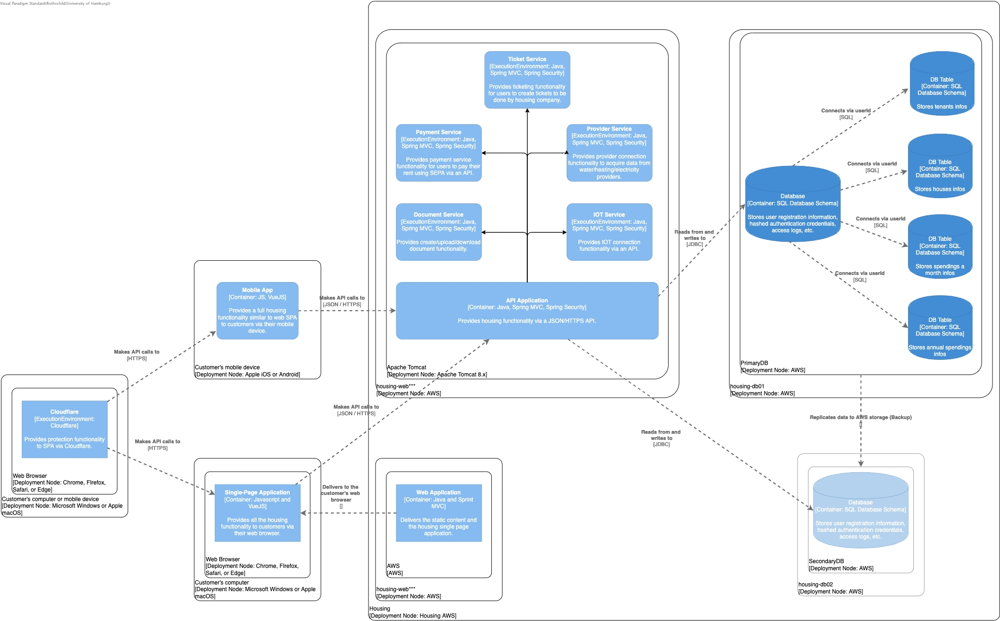

ifndef::imagesdir[:imagesdir: ../images]

[[section-design-decisions]]
== Architecture Decisions

=== Table of involved stakeholders

[orientation=landscape, options="header", cols="1,2,2,1"]
|===
| Name 
| Reason 
| Requirements 
| Diagram Type

| _Owner_ 
| 1. The owner needs to know mainly how the system will be used by the final users and also by him. +
  2. His main goal is to have a system with a clear and straightforward use from both sides (him and the users) and he also needs the system to address all the possible edge cases that can arise by using the system.
| 1. He doesn't really need to know the system general architecture and all the design decision taken.
  2. He mainly need to know usage of the system and maybe how it interacts with the third party services.
| The owner needs behavioral (Mockup/Wireframe, Sequence and Deployement) diagrams. 

| _Sponsor_ 
| -
| - 
| -

| _Project Manager (Lecturer) & Team Members (Developers)_ 
| PM/Developers part of the team must know what and how to implement the system.
| 1. PM/Developers need to know about the system general architecture. +
  2. They also need to know how the system components interact between them and also how they interact with the third party services. +
  3. To better understand the final product behaviour they also need to know how the final system will be used by the tenants. +
| PM/Developers need both structural and behavioral diagrams. 

| _Tenants (Users)_ 
| The users must know about some diagrams since their final UX can benefit from them.
| 1. The users must know how to interact with the system.
  2. They don't need to know how the system architecture or any design decision about it.
  3. They also don't need to know how the system communicates with the sensors, payment method and other thirs party services.
| Users needs behavioural (Mockup/Wireframe) diagrams.

| _Legal Department_ 
| 1. Some diagrams can help in representing and validating that the software behaves in a legally compliant manner during the interactions with other systems. +
  2. Legal requirements may specify certain orderings or conditions for some interactions.
| 1. Legal Department needs to know about interactions between objects or components in the system. 
  2. Legal Department needs to know about interactions between system and third party components.
| The legal department needs both structural (Deployment diagram) and behavioral (Sequence Diagrams and Mockup/Wireframe) diagrams.

|===

=== UML Diagrams

==== Component diagram 

==== Sequence diagram

image:login.jpg[]

==== Mockup/Wireframe for password reset
image:mockup-reset-pw.png[]

==== Deployment diagram
image:Deployment Diagram with Components.jpg[]

ifdef::arc42help[]
[role="arc42help"]
****
.Contents
Important, expensive, large scale or risky architecture decisions including rationales.
With "decisions", we mean selecting one alternative based on given criteria.

Please use your judgement to decide whether an architectural decision should be documented
here in this central section or whether you better document it locally
(e.g. within the white box template of one building block).

Avoid redundancy. 
Refer to section 4, where you already captured the most important decisions of your architecture.

.Motivation
Stakeholders of your system should be able to comprehend and retrace your decisions.

.Form
Various options:

* ADR (https://cognitect.com/blog/2011/11/15/documenting-architecture-decisions[Documenting Architecture Decisions]) for every important decision
* List or table, ordered by importance and consequences or:
* more detailed in form of separate sections per decision

.Further Information

See https://docs.arc42.org/section-9/[Architecture Decisions] in the arc42 documentation.
There you will find links and examples about ADR.

****
endif::arc42help[]
