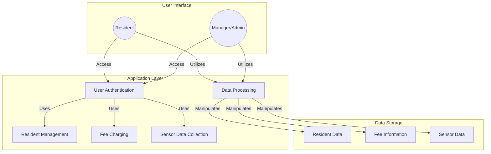

# Basic ideas

```
a software design architecture to process all the info related to heat fee, including functions of collecting info from sensors, managing when the resident moves out, charging fees etc. Interact mainly with two types of user, resident as normal users and managers and system maintainers as admins


use mermaid to create a diagram Create a coarse boxes and arrows diagram (only most basic components) to give yourself a better first overview of the system’s requirements.
```





# task 5

| **Use Case ID and Name** | UC001 - Record and Charge Heating Fees |
|--------------------------|--------------------------------------|
| **Actors**               | Tenant, Property Manager             |
| **Description**          | This use case involves recording and charging heating fees for rented houses. The system tracks the usage of heating resources in a house and calculates the corresponding fees for the tenant. |
| **Preconditions**        | 1. Tenant has an active rental agreement. 2. The heating system is installed and operational. |
| **Postconditions**       | 1. Heating fees are recorded for the specified period. 2. Tenant receives a bill for the heating charges. |
| **Invariants**           | None                                   |
| **Basic Workflow**       | 1. Tenant adjusts the heating preferences. 2. System records heating resource consumption. 3. System calculates heating fees based on usage. 4. Tenant receives a bill for the heating charges. |
| **Alternative Workflow**  | - If the heating system malfunctions, notify property manager and suspend fee calculation until the issue is resolved. - If tenant disputes the heating charges, initiate a review process and adjust fees if necessary. |
| **Risks**                | 1. Malfunction of heating system. 2. Disputes between tenant and property manager regarding fee calculation. |
| **Quality Goals**        | 1. Accuracy in calculating heating fees. 2. Timely generation and delivery of heating fee bills. |
| **Special Requirements** | 1. The system should support multiple methods of heating (e.g., central heating, electric heating) for accurate fee calculation. 2. Heating fee bills should be clear and itemized for easy understanding by the tenant. |
| **Assumptions**          | 1. Tenants are responsible for their heating charges as per the rental agreement. 2. The heating system is equipped with meters or sensors to measure consumption accurately. |


| **Use Case ID and Name** | UC002 - Register New Tenant |
|--------------------------|-----------------------------|
| **Actors**               | Landlord, New Tenant        |
| **Description**          | This use case involves the landlord registering a new tenant in the system when a property is rented out to a new occupant. |
| **Preconditions**        | 1. The landlord is logged into the property management system. 2. The property is available for rent. |
| **Postconditions**       | 1. The new tenant's information is added to the system. 2. The rental agreement is generated and stored. |
| **Invariants**           | None                        |
| **Basic Workflow**       | 1. Landlord logs into the property management system. 2. Landlord accesses the "New Tenant Registration" feature. 3. Landlord enters the new tenant's information (name, contact details, etc.). 4. Landlord specifies the terms of the rental agreement (duration, rent amount, etc.). 5. System validates the information provided. 6. System generates a unique identifier for the new tenant and stores their details. 7. System generates a rental agreement document. 8. Landlord reviews and confirms the registration. |
| **Alternative Workflow**  | - If the information provided is incomplete or invalid, the system prompts the landlord to correct the details. - If the rental agreement terms need negotiation, the landlord can enter a negotiation phase with the new tenant. |
| **Risks**                | 1. Incomplete or inaccurate tenant information. 2. Miscommunication regarding rental agreement terms. |
| **Quality Goals**        | 1. Accurate and complete recording of tenant information. 2. Efficient generation and storage of rental agreements. |
| **Special Requirements** | 1. The system should support the attachment of legal documents related to the rental agreement. 2. Notifications should be sent to both the landlord and the new tenant upon successful registration. |
| **Assumptions**          | 1. The landlord has the legal authority to rent out the property. 2. The property is in a suitable condition for occupancy. |


| **Use Case ID and Name** | UC003 - Handle Tenant Rent Delay |
|--------------------------|---------------------------------|
| **Actors**               | Property Manager, Tenant         |
| **Description**          | This use case involves the property manager addressing a situation where a tenant is delaying on paying rent. The goal is to initiate communication and resolve the issue in a timely and fair manner. |
| **Preconditions**        | 1. Tenant has not paid the rent on the due date. 2. Property manager is logged into the property management system. |
| **Postconditions**       | 1. Communication with the tenant regarding the rent delay is documented. 2. A plan for resolution is agreed upon, which may include late fees or a revised payment schedule. |
| **Invariants**           | None                                |
| **Basic Workflow**       | 1. Property manager receives a notification or identifies that a tenant's rent is overdue. 2. Property manager accesses tenant information in the property management system. 3. Property manager initiates communication with the tenant through the system, inquiring about the reason for the delay. 4. Tenant responds with the reason for the delay. 5. Property manager reviews the situation and determines appropriate actions, which may include imposing late fees or negotiating a new payment schedule. 6. Property manager updates the system with the details of the communication and any agreed-upon resolution. 7. If the issue persists, the property manager may escalate the matter following the established protocol. |
| **Alternative Workflow**  | - If the tenant provides a valid reason for the delay (e.g., unexpected financial hardship), the property manager may work with the tenant to establish a temporary solution. - If the tenant is unresponsive, the property manager may escalate the issue by sending formal notices or involving legal channels as per the rental agreement. |
| **Risks**                | 1. Miscommunication between the property manager and tenant. 2. Tenant disputes regarding late fees or resolution terms. |
| **Quality Goals**        | 1. Timely and clear communication regarding rent delays. 2. Fair and consistent application of policies for resolving rent delays. |
| **Special Requirements** | 1. The system should support the documentation of all communication related to rent delays. 2. Notifications to both parties should be clear and provide relevant information. |
| **Assumptions**          | 1. The rental agreement includes terms and policies regarding rent payments and late fees. 2. Both parties are expected to communicate through the system for transparency. |


| **Use Case ID and Name** | UC004 - Update System Security |
|--------------------------|--------------------------------|
| **Actors**               | System Administrator           |
| **Description**          | This use case involves the system administrator updating the security measures of the system to mitigate potential risks and ensure the protection of sensitive information and resources. |
| **Preconditions**        | 1. The system administrator has proper access rights. 2. Identified security vulnerabilities or a routine security update schedule. |
| **Postconditions**       | 1. The system's security measures are updated. 2. Documentation of the security update is recorded. |
| **Invariants**           | None                               |
| **Basic Workflow**       | 1. System administrator identifies the need for a security update, either through routine checks or the discovery of vulnerabilities. 2. System administrator logs into the system with appropriate credentials. 3. System administrator accesses the security settings and configurations. 4. System administrator applies the necessary updates, patches, or configuration changes to address identified vulnerabilities or enhance security. 5. System administrator tests the updated security measures to ensure they do not disrupt system functionality. 6. System administrator documents the details of the security update, including the changes made and any testing outcomes. 7. If the update is successful, the system administrator notifies relevant stakeholders about the security enhancement. |
| **Alternative Workflow**  | - If the security update requires system downtime, the system administrator coordinates with relevant parties to minimize disruption. - If the update reveals unforeseen issues or conflicts, the system administrator may need to roll back the changes and investigate the cause before reapplying the update. |
| **Risks**                | 1. Potential system downtime during the update. 2. Unforeseen issues or conflicts arising from the security update. |
| **Quality Goals**        | 1. Minimize system downtime during security updates. 2. Ensure that security updates do not introduce new vulnerabilities. |
| **Special Requirements** | 1. The system should support rollback mechanisms in case of issues with the security update. 2. Detailed documentation of security updates should be maintained for audit and compliance purposes. |
| **Assumptions**          | 1. The system administrator has a thorough understanding of the system's architecture and security requirements. 2. Relevant stakeholders are informed about the scheduled security update. |


| **Use Case ID and Name** | UC005 - Handle Broken Heat Sensor |
|--------------------------|----------------------------------|
| **Actors**               | Tenant, Maintenance Personnel    |
| **Description**          | This use case involves the process of identifying and resolving a broken heat sensor in a rented home to ensure the proper functioning of the heating system. |
| **Preconditions**        | 1. Tenant notices an issue with the heating system or reports a lack of accurate temperature readings. 2. Maintenance personnel have access to the home and the necessary tools for sensor replacement. |
| **Postconditions**       | 1. The broken heat sensor is replaced. 2. The heating system is functioning correctly. |
| **Invariants**           | None                                 |
| **Basic Workflow**       | 1. Tenant notices a discrepancy in the temperature readings or experiences issues with the heating system. 2. Tenant reports the issue to the property management system. 3. Property management system logs a maintenance request and notifies maintenance personnel. 4. Maintenance personnel schedule a visit to the home. 5. Maintenance personnel assess the heat sensor and confirm it is malfunctioning. 6. Maintenance personnel replace the broken heat sensor with a new one. 7. Maintenance personnel test the heating system to ensure it is functioning correctly. 8. Maintenance personnel update the property management system with details of the resolution. 9. Tenant is notified that the issue has been resolved. |
| **Alternative Workflow**  | - If the broken heat sensor is under warranty, maintenance personnel may contact the sensor manufacturer for a replacement. - If the replacement of the heat sensor requires a specialized technician, maintenance personnel may coordinate with external service providers. |
| **Risks**                | 1. Delay in addressing the issue may lead to discomfort for the tenant. 2. Unavailability of the required replacement parts or sensors. |
| **Quality Goals**        | 1. Timely resolution of heating system issues. 2. Accurate and reliable temperature readings after sensor replacement. |
| **Special Requirements** | 1. The property management system should efficiently log and track maintenance requests. 2. Maintenance personnel should have access to replacement parts and sensors as needed. |
| **Assumptions**          | 1. Tenants are prompt in reporting issues with the heating system. 2. Maintenance personnel are adequately trained to handle sensor replacements. |


| **Use Case ID and Name** | UC005 - Handle Broken Heat Sensor |
|--------------------------|----------------------------------|
| **Actors**               | Tenant, Maintenance Personnel    |
| **Description**          | This use case involves the process of identifying and resolving a broken heat sensor in a rented home to ensure the proper functioning of the heating system. |
| **Preconditions**        | 1. Tenant notices an issue with the heating system or reports a lack of accurate temperature readings. 2. Maintenance personnel have access to the home and the necessary tools for sensor replacement. |
| **Postconditions**       | 1. The broken heat sensor is replaced. 2. The heating system is functioning correctly. |
| **Invariants**           | The temperature readings from the heat sensor must be accurate and within an acceptable range. |
| **Basic Workflow**       | 1. Tenant notices a discrepancy in the temperature readings or experiences issues with the heating system. 2. Tenant reports the issue to the property management system. 3. Property management system logs a maintenance request and notifies maintenance personnel. 4. Maintenance personnel schedule a visit to the home. 5. Maintenance personnel assess the heat sensor and confirm it is malfunctioning. 6. Maintenance personnel replace the broken heat sensor with a new one. 7. Maintenance personnel test the heating system to ensure it is functioning correctly. 8. Maintenance personnel update the property management system with details of the resolution. 9. Tenant is notified that the issue has been resolved. |
| **Alternative Workflow**  | - If the broken heat sensor is under warranty, maintenance personnel may contact the sensor manufacturer for a replacement. - If the replacement of the heat sensor requires a specialized technician, maintenance personnel may coordinate with external service providers. |
| **Risks**                | 1. Delay in addressing the issue may lead to discomfort for the tenant. 2. Unavailability of the required replacement parts or sensors. |
| **Quality Goals**        | 1. Timely resolution of heating system issues. 2. Accurate and reliable temperature readings after sensor replacement. |
| **Special Requirements** | 1. The property management system should efficiently log and track maintenance requests. 2. Maintenance personnel should have access to replacement parts and sensors as needed. |
| **Assumptions**          | 1. Tenants are prompt in reporting issues with the heating system. 2. Maintenance personnel are adequately trained to handle sensor replacements. |
